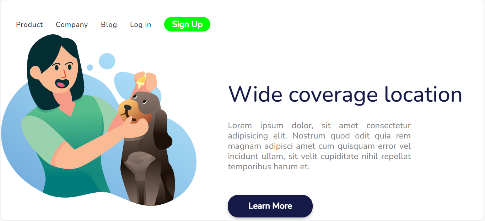

<h1>Wide Coverage Location</h1>

<h2>Esse foi um projeto que eu aprendi no <a href=""https://rodolfomori.com.br/devclub>DevClub</a></h2>

Nesse projeto foi utilizado as seguintes tecnoçogias:

-HTML
-CSS
-GIT
-GITHUB

